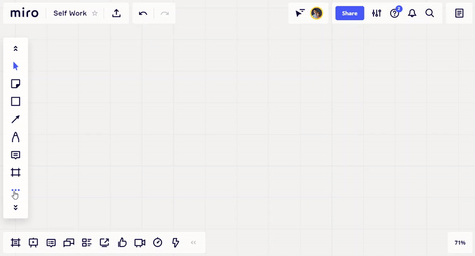
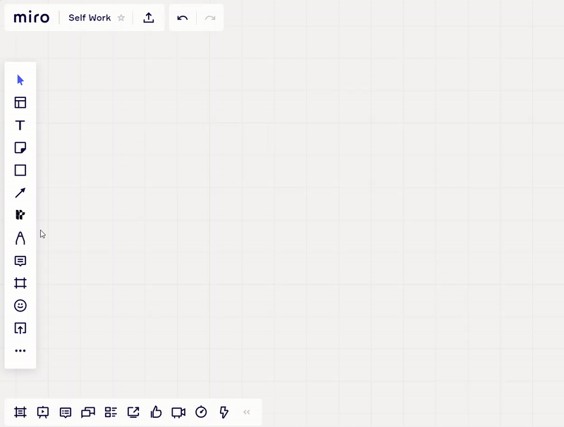
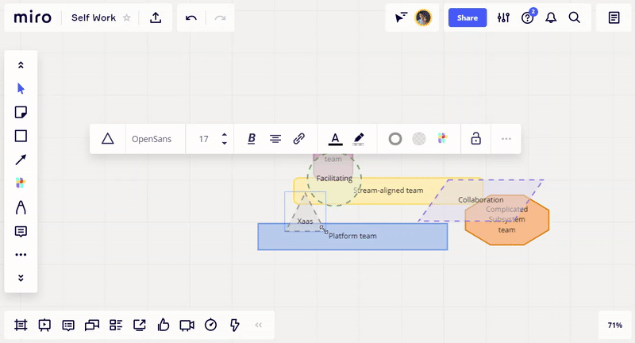

# Team Topologies web plugin for Miro

This plugin provides you ready to use shapes to build ([Team Topologies](https://teamtopologies.com)).

Based on some of the ideas in the book Team Topologies by Matthew Skelton [@matthewskelton](https://github.com/matthewskelton) and Manuel Pais [@manupaisable](https://github.com/manupaisable).
Trying to align with the templates available in [this repo](https://github.com/TeamTopologies/Team-Shape-Templates#available-team-shapes)

> See [teamtopologies.com](https://teamtopologies.com) for more details about Team Topologies.

> Copyright © 2018-2021 [Team Topologies](https://teamtopologies.com) - Licenced under [CC BY-SA 4.0](https://creativecommons.org/licenses/by-sa/4.0/) 

# How it works

You can try the official plugin directly from [Miro Marketplace](https://miro.com/marketplace/team-topologies/).

Setup the Team Topologies icon from your library

Start to drag & drop the shapes you need

Once you have added the required shapes onto your whiteboard, you can edit them as much as you want (since these are standard Miro shapes):

# Contribute

## Run the app

- Install dependencies with `npm install`
- Run the app with `npm start`

## Configure your Dev Team and local app in Miro

Follow [these steps](https://developers.miro.com/docs/build-your-first-hello-world-app#step-2-create-a-developer-team-in-miro) to configure a new Miro Dev Team.
Then use your local app URL (default: `localhost:3000`) to configure the app.
